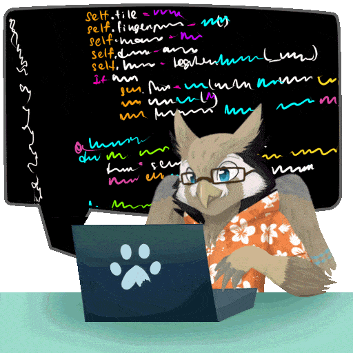

:::{.column-body-outset}
{fig-align="center"}
:::

## Introducción

¡Bienvenid\@s! 🦉

Nos da mucho gusto dar inicio al curso introductorio al uso de R y Python para la detección automatizada de fauna en fototrampeo 🤓

Este es el manual del participante, donde podrás consultar cada uno de los pasos que realizaremos y el contenido de manera general, así como todos los códigos y resultados que obtendremos a lo largo del flujo de trabajo.

El objetivo de este manual es que sea interactivo, claro y sea una guía útil para que puedas replicar los códigos con facilidad.

Estamos seguros de que esta guía te ayudará a disfrutar de este proceso sin que programar sea un dolor de cabeza, cuando puede ser muy divertido. Permitirá potencializar tu desarrollo profesional y muy importante, permitirte cumplir con cualquier objetivo que tengas relacionado con la gestión ambiental, monitoreo y/o conservación de la biodiversidad.

{fig-align="center"}

## Instalación de R y RStudio 🧑🏻‍💻

Primero, es importante tener instalado R que es el lenguaje de programación y RStudio que es la interfaz de edición del código, para esto, puedes consultar este [video de Youtube](https://www.youtube.com/watch?v=D9Bp11iZssc)


## Instalación de Positron 🤖

Una amplia recomendación que haremos es adelantarse a instalar Positron, el cual es un editor de código creado por Posit (la empresa anteriormente conocida como RStudio). Está diseñado para flujos de trabajo de ciencia de datos, análisis y estadística, ofreciendo la ejecución simultanea de código en R y Python. Para esto, puedes consultar este [video de Youtube](https://www.youtube.com/watch?v=ZkZXrJNepP0)

## Instalación de Python 🐍

La instalación de Python la estaremos realizando a partir de Miniforge, el cual es un entorno para instalar y ejecutar código Python. Para instalarlo en Windows simplemente descarga y [ejecuta este enlace de instalación en Windows](https://github.com/conda-forge/miniforge/releases/latest/download/Miniforge3-Windows-x86_64.exe). Si te aparece un mensaje de seguridad, da clic en "Descargar de todos modos".

Para confirmar que estás en la consola de Miniforge verás un nombre de entorno entre paréntesis antes de tu directorio actual, como este: `(base) c:\>`

## Crear un entorno virtual de Python 

Un entorno virtual es un espacio de trabajo independiente y aislado en tu computadora el cual contendrá su propia instalación de Python y sus librerías. Permite la reproducibilidad, evita el conflicto de versiones, facilita la portabilidad y permite no tener instaladas tantas librerías y archivos en tu computadora.

En MiniForge copia y pega los siguientes códigos, primero la línea de creación del entorno y luego la línea de activación. Una vez creado el entorno ya no es necesario volverlo a crear, cuando abras de nuevo MiniForge para un nuevo análisis, sólo ejecuta la segunda línea:

```python
conda create -n speciesnet python=3.11 pip -y # crear el entorno (una vez)

conda activate speciesnet #activar el entorno 
```
Una vez que se haya ejecutado adecuadamente y activado el entorno virtual, debes ver un comando como este: `(speciesnet) c:\>` también puede aparecer como: `(speciesnet) c:\>Users\Tu_usuario`

Ahora sí, estamos listos para ejecutar el modelo de speciesnet 😉😎

##  Instalación del paquete SpeciesNet 🐆

Para la instalación del paquete de SpeciesNet usaremos el siguiente código:

```python
pip install speciesnet #instalar paquete

pip install speciesnet --use-pep517 # para Mac si es que aparece error
```
Para confirmar que el paquete se ha instalado, ejecutamos la siguiente línea de código la cual nos está diciendo que nos comparta información de ayuda sobre el paquete y deberás observar un texto de ayuda sobre el scrip principal para SpeciesNet.

```python
python -m speciesnet.scripts.run_model --help
```
## Ejecución de SpeciesNet 

La ejecución del modelo lo haremos mediante el script "run_model" usando el siguiente comando:

```python
python -m speciesnet.scripts.run_model --folders "c:\tu\carpeta\imagenes" --predictions_json "c:\carpeta\salida\nombre_archivo.json" --country MEX

```
Ahora, aquí es muy importante entender los componentes del código donde se definirán las rutas a las carpetas donde se encuentran las fotografías a analizar y la carpeta donde se guardarán los resultados. Al ejecutar el modelo, obtendrás un archivo en formato **.json**

Por lo tanto, en la primer ruta, va la dirección a tus fotografías y en la segunda ruta, la carpeta donde se exportarán tus resultados en formato .json. Es muy importante que al finalizar la ruta, escribas el nombre del archivo y la extensión. ***P.ej.*** `"c:\analisis\resultado\resul_trampa_01.json"` 

### Delimitar la región geográfica 🌎

Una **observación muy importante** es asignar el país al cual se va a delimitar la identificación, de lo contrario, puede indentificar a un coyote como un lobo o especies que no pertenecen al país. Para definir el país se usa el código de tres letras [ISO 3166-1 alfa-3](https://en.wikipedia.org/wiki/ISO_3166-1_alpha-3) en el caso de México es: `--country MEX`

Es importante recordar que este proceso se ejecuta en conjunto el clasificador general **Megadetector** el cual se encarga de clasificar por vehículos, personas o animales (incluyendo animales domécticos) y el clasificador específico (las especies) por **SpeciesNet** el cual se encarga de asignar la especie con base en la delimitación geográfica y con sus respectivos porcentajes de precisión.


## Visualización de la salida de SpeciesNet 🎞️

Como vimos anteriormente, el formato de salida al ejecutar el modelo SpeciesNet es un archivo .json. Para poder hacer la visualización de las imágenes con sus respectivos cuadros delimitadores es necesario instalar la herramienta de visualización de Megadetector:

```python
pip install megadetector-utils #instalar la herramienta de visualización

python -m megadetector.visualization.visualize_detector_output "c:\archivo\resultado\nombre_archivo.json" "c:\carpeta\donde\quieres\visualizar\resultados" --html_output_file "carpeta\para\exportar\html\resumen.html"

```
La primera línea de código instala la herramienta de visualización. La segunda línea asigna las carpetas donde:

- La ruta donde se encuentra tu archivo .json como resultado de ejecutar SpeciesNet 
- La ruta donde se encuentra la carpeta donde quieres que se guarden las imágenes
- La ruta donde se encuentra la carpeta donde quieres que se guarde el reporte en .html

Así es como se ve cuando el modelo ha corrido adecuadamente:

{fig-align="center"}

# Organización de resultados en carpetas 📁

Una vez que hemos obtenido nuestro .html con el resumen de nuestro análisis, podemos ejecutar una función adicional para que las fotografías se organicen de acuerdo con la clasificación asignada. Para esto, ejecutaremos el siguiente código:

```python

python -m megadetector.postprocessing.postprocess_batch_results "D:\ruta\ archivo \resultado.json" "D:\ruta_carpeta_seleccionada\post-procesamiento" --image_base_dir "D:\ruta_carpeta_fotos_originales\imputs"

```

Una vez generado esto, podremos visualizar los .html por cada grupo clasificado y usar el index.html como un "menú" con la información de todas nuestras identificaciones. Este es un ejemplo de lo que podríamos generar y mostrar para un reporte: [Resumen de análisis fototrampa](https://merry-kelpie-063064.netlify.app)

